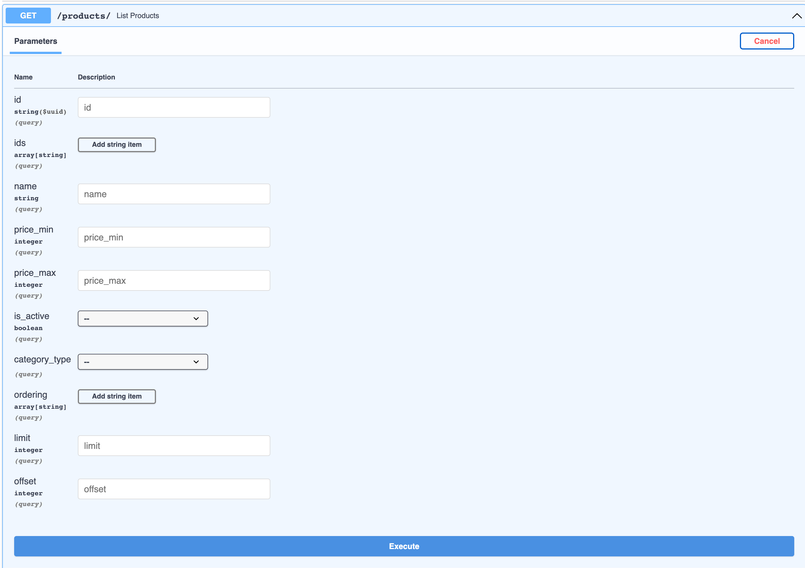

## FastApi Example

This example shows how to use `sqlalchemy-filterset` with [FastAPI](https://fastapi.tiangolo.com/)
and [SQLAlchemy](https://www.sqlalchemy.org/).


The source code is available on the
[Github](https://github.com/sqlalchemy-filterset/sqlalchemy-filterset).


## Application structure

Application has next structure:

```
./
├── webapp/
│   ├── __init__.py
│   ├── application.py
│   ├── endpoints.py
│   ├── schemas.py
│   ├── models.py
│   ├── filters.py
│   ├── queries.py
│   └── tests.py
├── config.yml
├── docker-compose.yml
├── Dockerfile
└── requirements.txt
```

## Create FastAPI application

```python title="webapp/application.py"
--8<-- "docs_src/examples/fastapi/application.py"
```

## Models
For example create models for e-commerce application.
More information about the models can be found in the
[official sqlalchemy documentation](https://docs.sqlalchemy.org/en/14/orm/quickstart.html)

```python title="webapp/models.py"
--8<-- "docs_src/examples/fastapi/models.py"
```

## Schemas
Add simple schemas for `Product` model.

```python title="webapp/schemas.py"
--8<-- "docs_src/examples/fastapi/schemas.py"
```

## Filters
Add `FilterSet` and `FilterSchema` for the `Product` model.

```python title="webapp/filters.py"
--8<-- "docs_src/examples/fastapi/filters.py"
```

## Queries
Add queries for api endpoints.
```python title="webapp/queries.py"
--8<-- "docs_src/examples/fastapi/queries.py"
```

## Endpoints
Add endpoints for the application.

```python title="webapp/endpoints.py"
--8<-- "docs_src/examples/fastapi/endpoints.py"
```

## Usage
Run application with `uvicorn`.

```bash
uvicorn webapp.application:app --reload
```
Go to http://127.0.0.1:8000/docs




## Conclusion
In conclusion, this example demonstrates how to use the `sqlalchemy-filterset` library
with `FastAPI` and `SQLAlchemy`. It shows the structure of an application that uses this library,
including the creation of a `FastAPI` application, models, schemas, and filters.
The example also includes usage of various filters such as `InFilter`, `RangeFilter`,
and `OrderingFilter` to filter data from the database. The example also demonstrates the use of
`RelationJoinStrategy` to filter data from related models.
